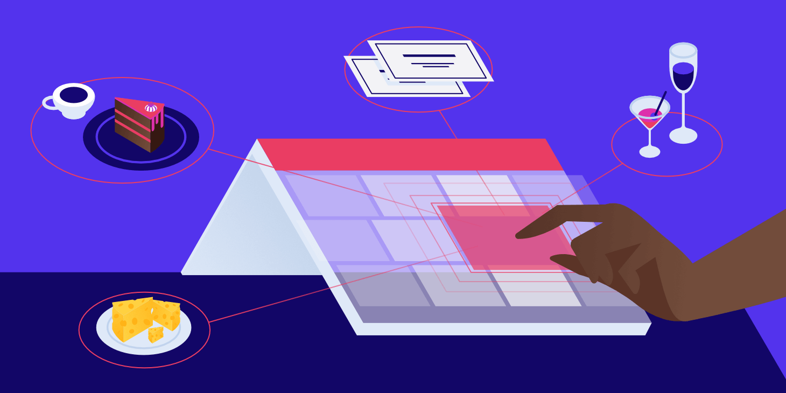

<a name="readme-top"></a>

<div align="center">

<h1><b>BookingBites App</b></h1>
 
  
  <br/>

</div>


# 📗 Table of Contents

- [📖 About the Project](#about-project)
  - [🛠 Built With](#built-with)
    - [Tech Stack](#tech-stack)
    - [Key Features](#key-features)
  - [🚀 Live Demo](#live-demo)
  - [📽️ Video Intro](#video)
- [💻 Getting Started](#getting-started)
  - [Prerequisites](#prerequisites)
  - [Setup](#setup)
  - [Install](#install)
  - [Usage](#usage)
  - [Run tests](#run-tests)
  - [Deployment](#triangular_flag_on_post-deployment)
- [👥 Authors](#authors)
- [🔭 Future Features](#future-features)
- [🤝 Contributing](#contributing)
- [⭐️ Show your support](#support)
- [🙏 Acknowledgements](#acknowledgements)
- [❓ FAQ](#faq)
- [📝 License](#license)

# 📖 [BookingBites App APP] <a name="about-project"></a>

**[BookingBites App APP]** Built with Ruby on Rails on the backend and React & Redux on the frontend, our responsive web application offers a seamless dining reservation experience. Users can conveniently choose their preferred dining ambience, whether it's the cozy bar, the chic lounge, the scenic rooftop, the tranquil garden, or the vibrant live music area. This project represents the final capstone of our Microverse journey.

## 🛠 Built With <a name="built-with"></a>

1- Ruby 3.2.2<br>
2- Rails 7.0.7.2<br>
3- PostgreSQL<br>
4- React & Redux<br>
5- Gitflow<br>
6- Rubocop<br>
7- RSpec

### Tech Stack <a name="tech-stack"></a>

<details>
  <summary>Client</summary>
  <ul>
    <li><a href="https://www.microverse.org/">Microverse</a></li>
  </ul>
</details>

<details>
<summary>Ruby</summary>
  <ul>
    <li><a href="https://www.ruby-lang.org/">Ruby</a></li>
  </ul>
</details>

<details>
<summary>Rails</summary>
  <ul>
    <li><a href="https://www.rubyonrails.org/">Rails</a></li>
  </ul>
</details>

<details>
<summary>Database</summary>
  <ul>
    <li><a href="https://www.postgresql.org/">PostgreSQL</a></li>
  </ul>
</details>

<details>
<summary>React</summary>
  <ul>
    <li><a href="https://es.react.dev/">React</a></li>
  </ul>
</details>

<details>
<summary>Redux</summary>
  <ul>
    <li><a href="https://redux.js.org/">Redux</a></li>
  </ul>
</details>

### Key Features <a name="key-features"></a>

- **[Set up the repository and tools]**
- **[Implemented the authentication and authorization using Devise]**
- **[Created the page to add a category]**
- **[Created the splash page]**
- **[Created registration and login page]**
- **[Created the page to add a reservation]**
- **[Created the reservations page]**
- **[Added unit and integrations tests]**
- **[Deployed the project]**
- **[Recorded a video describing project]**

<p align="right">(<a href="#readme-top">back to top</a>)</p>

## 🚀 Live Demo <a name="live-demo"></a>

- [BookingBites App Coming Soon !!!](https://github.com/JuanDBta/booking-bites)

<p align="right">(<a href="#readme-top">back to top</a>)</p>

## 📽️ Video Intro <a name="video"></a>

- [Loom Introduction Video Coming Soon !!!](https://github.com/JuanDBta/booking-bites)

<p align="right">(<a href="#readme-top">back to top</a>)</p>

## 💻 Getting Started <a name="getting-started"></a>

To get a local copy up and running, follow these steps.

### Prerequisites

In order to run this project you need:

Web Browser (Chrome recommended)<br>
Code editor (VS recommended)<br>
GitHub account<br>

### Setup

Clone this repository to your desired folder:

```sh
  cd my-folder
  git clone "https://github.com/JuanDBta/booking-bites.git"
```
### Install

Go to your /booking-bites folder:

```sh
  cd booking-bites
  bundle install
```
### Usage

```sh
  rails server
```

### Run Tests

```sh
  rspec spec
```

### Deployment

You can deploy this project using:<br>- [BookingBites App Coming Soon !!!](https://github.com/JuanDBta/booking-bites)
<p align="right">(<a href="#readme-top">back to top</a>)</p>

## 👥 Authors <a name="authors"></a>

👤 **Micronaut Betel Andarge**

- GitHub: [@beteland123](https://github.com/beteland123)
- Twitter: [@betelandarge](https://twitter.com/BetelAndarge)
- LinkedIn: [LinkedIn](https://linkedin.com/in/betelandarge)

👤 **Micronaut JUAN DAVID DIAZ**

- GitHub: [@JuanDBta](https://github.com/JuanDBta)
- Twitter: [@simplebetsas](https://twitter.com/simplebetsas)
- LinkedIn: [LinkedIn](https://linkedin.com/in/simplebet/)

<p align="right">(<a href="#readme-top">back to top</a>)</p>

## 🔭 Future Features <a name="future-features"></a>

- [ ] **[Add animations and transitions]**
- [ ] **[Add more functionalities to navigation bar]**

<p align="right">(<a href="#readme-top">back to top</a>)</p>

## 🤝 Contributing <a name="contributing"></a>

Contributions, issues, and feature requests are welcome!

Feel free to check the [issues page](../../issues/).

<p align="right">(<a href="#readme-top">back to top</a>)</p>

## ⭐️ Show your support <a name="support"></a>

If you like this project, please give me a like, it doesn't cost you anything and it helps me a lot to keep working.

<p align="right">(<a href="#readme-top">back to top</a>)</p>

## 🙏 Acknowledgments <a name="acknowledgements"></a>

We would like to thank Bee in Student Success who is always avalaible to solve issues and Microverse for push us to work hard every day!

Credit goes to [Murat Korkmaz on Behance](https://www.behance.net/muratk) whose original design was used.

<p align="right">(<a href="#readme-top">back to top</a>)</p>

## ❓ FAQ <a name="faq"></a>

- **["How can I see more projects associated with these authors?"]**

  - Check my [@beteland123](https://github.com/beteland123)
  - Check my [@JuanDBta](https://github.com/JuanDBta)

- **[How can I contact the authors of this project?]**

  - Check my [Betel Andarge LinkedIn profile](https://linkedin.com/in/betelandarge)
  - Check my [Juan Díaz LinkedIn profile](https://linkedin.com/in/simplebet/) or email me at simplebetsas@gmail.com
  
<p align="right">(<a href="#readme-top">back to top</a>)</p>

## 📝 License <a name="license"></a>

This project is [MIT](./LICENSE) licensed.

<p align="right">(<a href="#readme-top">back to top</a>)</p>
 